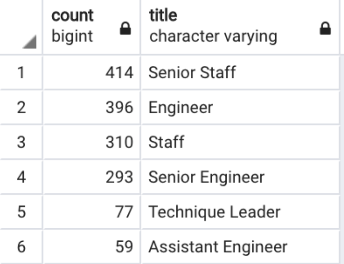

# Pewlett-Hackard-Analysis

## Pewlett-Hackard Analysis Overview

In this project, our overall objective was to use our analysis to solve a variety of questions. Primarily, we focused on determining how many employees were retiring per title and those who qualified to be a part of the mentorship eligibility program depending on their seniority, which determined eligibility.

## Results

When it came to amount of employees that were ready to retire, the majority were: 

* Senior Engineers and Senior Staff

In comparison to the rest of the positions that were ready to retire, based on our analysis, we were able to infer that:

* A small amount of retiring titles are in the management position titles.

* There is a a large difference between retiring staff versus those who will be eligible to participate in the mentorship program.

Based on our analysis, it was easy to note with our results that there is a disporportion between the distribution of job titles and employees.

## Summary

How many roles will need to be filled as the "silver tsunami" begins to make an impact?

The amount of roles that have to be filled within the next four years are: 
* 90, 398

Are there enough qualified, retirement-ready employees in the departments to mentor the next generation of Pewlett Hackard employees?

No, because there are not enough qualified employees that could train the next generation of Pewlett Hackard employees.

